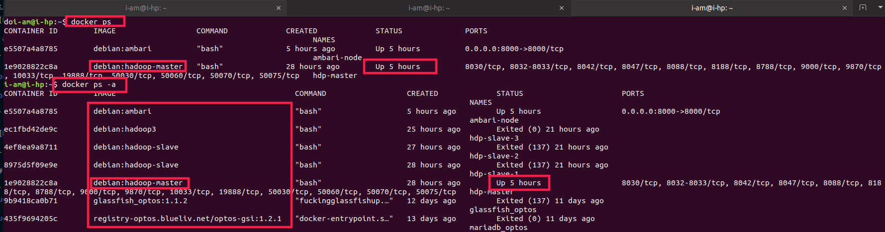
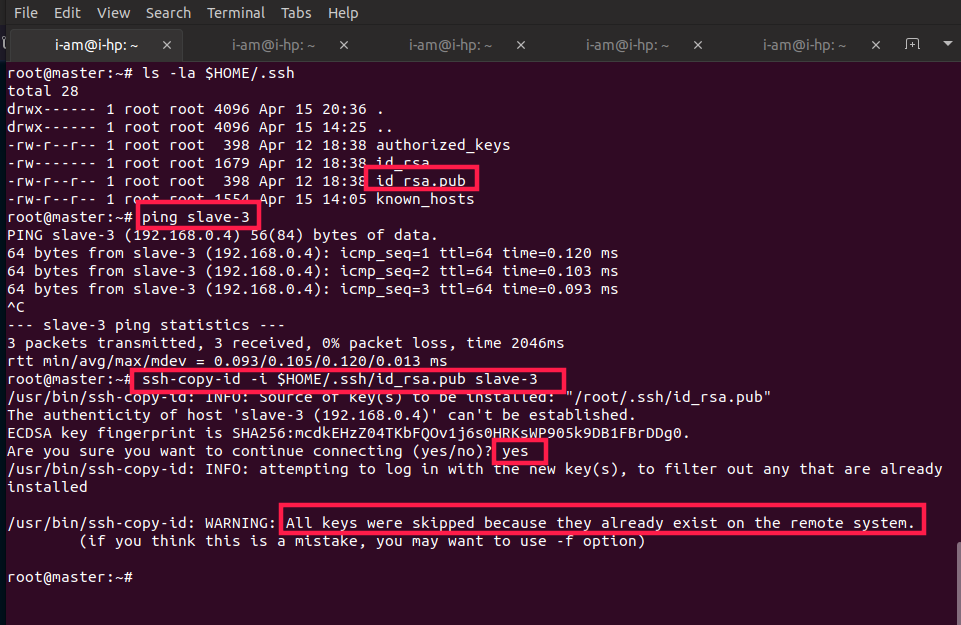
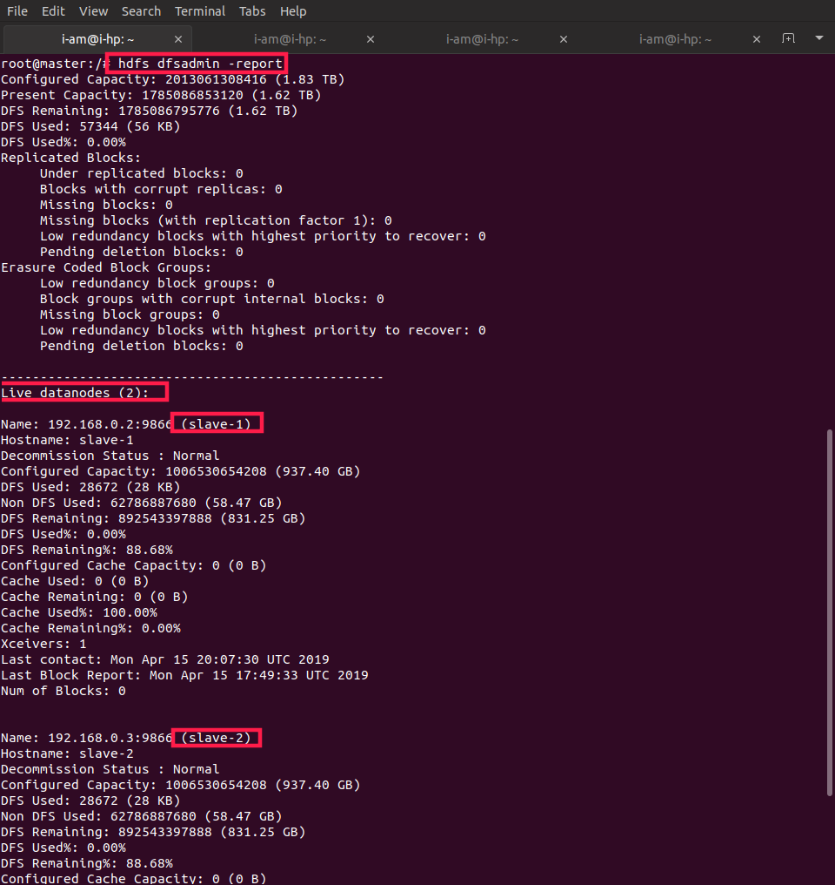
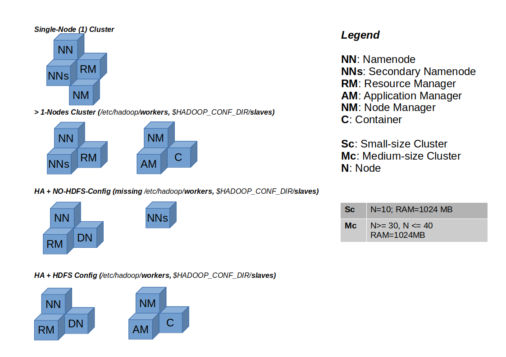
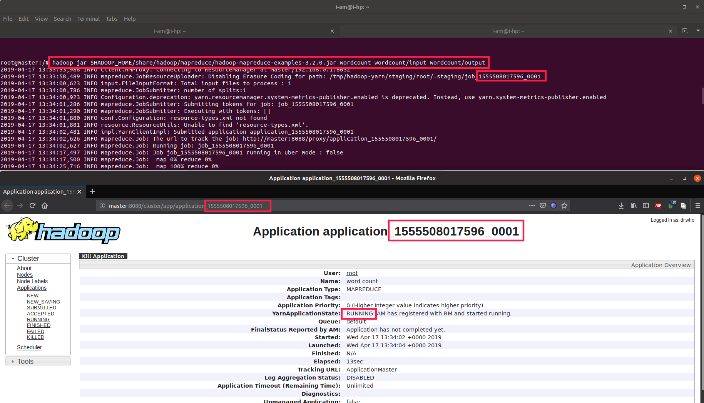
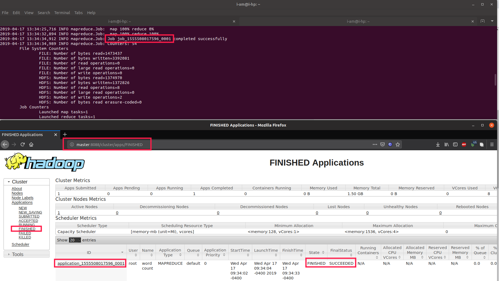
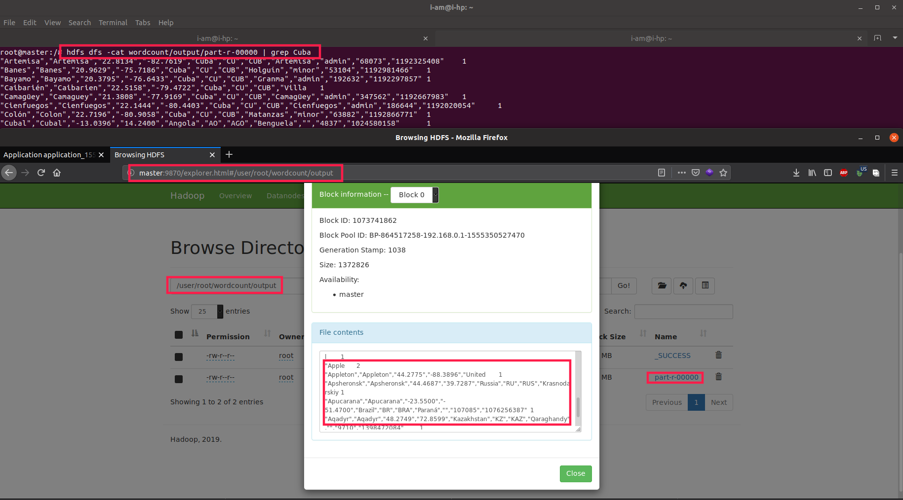
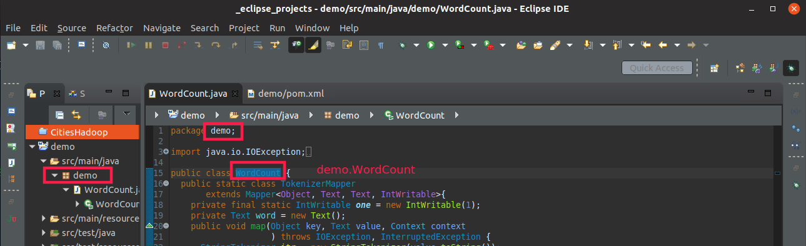

# Hadoop Cluster Installation

> ## *Step-By-Step guide for Hadoop Single Node/Cluster Deployment*
>
> *Hadoop version: 3.2.0*

---

## *Docker Useful Commands*

- ### Start a Docker Container

```bash

docker start -i <container-name> # e.g Start a container (already created, see: 'List Docker containers')

```

- ### *Enter a Docker Container*

```bash

docker exec -it <container-name> bash # e.g docker exec -it hdp-master bash

```

- ### *Copy a File/Directory From/Into a Docker Container*

```bash

# From Host to Docker:
docker cp <local-directory>/<folder-to-copy> <docker-name/docker-id>:/<docker-container-folder> # e.g docker cp  /local/folder/to/copy hdp-master:/opt

# From Docker to Host:
docker cp <docker-name/docker-id>:/<docker-container-folder> <local-directory>/<folder-to-copy> # e.g docker cp hdp-master:/opt /local/target/folder


# !!!Important: Please notice only command <parts> flipped
```

- ### *Delete a Docker Network*

```bash

docker network rm <network-name> # e.g docker network rm hadoop-cluster

```

- ### *Delete a Docker Container*

```bash

docker rm -f <container-name> # e.g docker rm -f hdp-master  ('-f' forces closing a running container)

```

- ### *Delete a Docker Image*

```bash

docker rm -f <container-name> # e.g docker rm -f hdp-master  ('-f' forces closing a running container)

```

- ### *Import a Docker Image*

```bash

docker load -i /path/of/tar/file # e.g /home/hadoop/debian-image.tar

docker images # Lists available docker images

```

- ### *List Docker Images*


- ### *List Docker Containers*

```bash

docker ps # Shows all running containers

docker ps -a # Shows all containers (created: up & down)

```



---

## Docker Installation

```bash

sudo apt-get update

sudo apt-get install \
    apt-transport-https \
    ca-certificates \
    curl \
    gnupg-agent \
    software-properties-common

curl -fsSL https://download.docker.com/linux/ubuntu/gpg | sudo apt-key add -

sudo apt-key fingerprint 0EBFCD88

sudo add-apt-repository \
   "deb [arch=amd64] https://download.docker.com/linux/ubuntu \
   $(lsb_release -cs) \
   stable"

sudo apt-get update

sudo apt-get install docker-ce docker-ce-cli containerd.io

sudo usermod -aG docker $(whoami)

# Needs to be logged in Docker remote registry
# $ docker login
sudo docker run hello-world

```

## Docker-compose Installation

```bash

sudo curl -L "https://github.com/docker/compose/releases/download/1.24.0/docker-compose-$(uname -s)-$(uname -m)" -o /usr/local/bin/docker-compose

sudo chmod +x /usr/local/bin/docker-compose

sudo ln -s /usr/local/bin/docker-compose /usr/bin/docker-compose

docker-compose --version

```

## *[Option 1]* Single-Node Cluster (*Command Line*)

```bash

docker run -it -h hadoop-namenode --name hadoop-namenode --net=host -p 8030:8030 -p 8032:8032 -p 8033:8033 -p 8042:8042 -p 8047:8047 -p 8088:8088 -p 8188:8188 -p 788:8788 -p 9000:9000 -p 9870:9870 -p 10033:10033 -p 19888:19888 -p 50030:50030 -p 50060:50060 -p 50070:50070 -p 50075:50075 -v /var/log/hadoop:/opt/hadoop/logs -v /var/local/hadoop:/root/shared debian:hadoop-master
```

## *[Option 2]* Single-Node Cluster (*docker-compose.yml*)

```yaml

version: "3"
networks:
  hadoop-cluster:
    driver: bridge
services:
  hadoop:
    build: .
    image: debian:hadoop-master
    entrypoint: sh /start-cluster.sh
    tty: true
    networks:
    - hadoop-cluster 
    # deploy:
    #   replicas: 3
    volumes:
      - /var/log/hadoop:/opt/hadoop/logs
      - /var/local/hadoop:/root/shared
    ports:
    - "8030:8030"
    - "8032:8032"
    - "8033:8033"
    - "8042:8042"
    - "8047:8047"
    - "8088:8088"
    - "8188:8188"
    - "8788:8788"
    - "9000:9000"
    - "9870:9870"
    - "10033:10033"
    - "19888:19888"
    - "50030:50030"
    - "50060:50060"
    - "50070:50070"
    - "50075:50075"
```

## Running **docker-compose** for *docker-compose.yml*

```bash

cd /path/to/composer/file/folder  # e.g /home/hadoop/, contains 'docker-compose.yml'
docker-compose up

# Or:

docker compose -f "/path/to/composer/file/folder/docker-compose.yml" up

```

### *Installing local tools*

```bash

apt install curl nano less wget ssh rsync telnet

```

## Environment variables setup / entrypoint (*/start-cluster.sh*)

```bash
#!/bin/bash

# Files: /start-cluster.sh or /root/.bashrc

export JAVA_HOME=/usr  # If Java is portable (e.g jdk1.8.0_201.tar.gz), set value with: /opt/jdk1.x.y_z  e.g /opt/jdk1.8.0_201
export HADOOP_HOME=/opt/hadoop-3.2.0

export HADOOP_CONF_DIR=$HADOOP_HOME/etc/hadoop
export HADOOP_COMMON_HOME=$HADOOP_HOME
export HADOOP_MAPRED_HOME=$HADOOP_HOME
export HADOOP_HDFS_HOME=$HADOOP_HOME
export YARN_HOME=$HADOOP_HOME/bin

export HDFS_NAMENODE_USER="root"
export HDFS_DATANODE_USER="root"
export HDFS_SECONDARYNAMENODE_USER="root"
export YARN_RESOURCEMANAGER_USER="root"
export YARN_NODEMANAGER_USER="root"

export HADOOP_CLASSPATH=$HADOOP_CONF_DIR,$HADOOP_COMMON_HOME/*,$HADOOP_COMMON_HOME/lib/*,$HADOOP_HDFS_HOME/*,$HADOOP_HDFS_HOME/lib/*,$HADOOP_MAPRED_HOME/*,$HADOOP_MAPRED_HOME/lib/*,$HADOOP_YARN_HOME/*,$HADOOP_Y$

export PATH=$PATH:$JAVA_HOME:$JAVA_HOME/bin:$HADOOP_HOME/bin:$HADOOP_HOME/sbin:$HADOOP_CLASSPATH

export HADOOP_OPTS="-Djava.library.path=$HADOOP_HOME/lib/native"

# !!!Important: Exclude this section below from file: .bashrc
service ssh start && start-all.sh

tail -f /dev/null

```

## *[Option 3]* Cluster (*1 Master*, **3-Slaves**)

---

### *Cluster Network*

```bash

docker network create --driver=bridge \
--subnet=192.168.0.0/24 \
--ip-range=192.168.0.0/24 \
--gateway=192.168.0.254 \
hadoop-cluster

```

### *Master Node*

```bash

docker run -it -h master --name hdp-master --cpus=1 \
--memory="1024MB" --memory-swap="2048MB" \
--net=hadoop-cluster --ip="192.168.0.1" \
--add-host="slave-1:192.168.0.2" \
--add-host="slave-2:192.168.0.3" \
--add-host="kafka:192.168.0.101" \
-p 8030:8030 -p 8032:8032 -p 8033:8033 -p 8042:8042 \
-p 8047:8047 -p 8088:8088 -p 8188:8188 -p 788:8788 \
-p 9000:9000 -p 9870:9870 -p 10033:10033 -p 19888:19888 \
-p 50030:50030 -p 50060:50060 -p 50070:50070 -p 50075:50075 \
-v /var/log/hadoop:/opt/hadoop/logs -v /var/local/hadoop:/root/shared \
debian:hadoop-master

```

### *Slave (1) Node*

```bash

docker run -it -h slave-1 --name hdp-slave-1 --cpus=1 \
--memory="1024MB" --memory-swap="2048MB" \
--workdir="/home/hadoop/" --net=hadoop-cluster --ip="192.168.0.2" \
--add-host="master:192.168.0.1" \
--add-host="slave-2:192.168.0.3" \
debian:hadoop-slave

```

### *Slave (2) Node*

```bash

docker run -it -h slave-2 --name hdp-slave-2 --cpus=1 \
--memory="1024MB" --memory-swap="2048MB" \
--workdir="/home/hadoop/" --net=hadoop-cluster --ip="192.168.0.3" \
--add-host="master:192.168.0.1" \
--add-host="slave-1:192.168.0.2" \
debian:hadoop-slave

```

### *Slave (3) Node*

```bash

docker run -it -h slave-3 --name hdp-slave-3 --cpus=1 \
--memory="1024MB" --memory-swap="2048MB" \
--workdir="/home/hadoop/" --net=hadoop-cluster --ip="192.168.0.4" \
--add-host="master:192.168.0.1" \
--add-host="slave-1:192.168.0.2" \
--add-host="slave-2:192.168.0.3" \
debian:hadoop-slave

```

---

## Default configuration (Slaves)

## File: **/etc/hadoop/workers**

### Add hosts values
>
> e.g (Master Node)

```bash

master

```

> e.g (Slaves Nodes)

```bash

slave-1
slave-2
slave-3

```

---

## File: **$HADOOP_CONF_DIR/slaves**

> e.g (Slaves Nodes)

```bash

slave-1
slave-2
slave-3

```

---

## [Install Java JDK 8](http://tipsonubuntu.com/2016/07/31/install-oracle-java-8-9-ubuntu-16-04-linux-mint-18/)

```bash
sudo add-apt-repository ppa:webupd8team/java

sudo apt update; sudo apt install oracle-java8-installer

javac -version

sudo apt install oracle-java8-set-default

```

### *[**Optional**] Install Java package (**jdk-8u211-linux-x64.tar.gz**)*

#### Go to: [Java Oracle Downloads](https://www.oracle.com/technetwork/java/javaee/downloads/jdk8-downloads-2133151.html)

```bash

docker cp <local-folder>/jdk-8u211-linux-x64.tar.gz <container-name/docker-id>:/opt

docker exec -it <container-name> bash

tar -xzvf /opt/jdk-8u211-linux-x64.tar.gz  # JAVA_HOME: /opt/jdk1.8.0_201

```

---

## File: **$HADOOP_CONF_DIR/hadoop-env.sh**

```bash
export JAVA_HOME=/usr  #e.g Optional: /opt/jdk1.8.0_201
```

---

## File: **$HADOOP_CONF_DIR/core-site.xml**

```xml
 <property>
  <name>fs.default.name</name>
  <value>hdfs://master:9000</value>
 </property>

```

---

## File: **$HADOOP_CONF_DIR/mapred-site.xml**

```xml
<property>
  <name>mapreduce.framework.name</name>
  <value>yarn</value>
 </property>
<property>
  <name>yarn.app.mapreduce.am.resource.mb</name>
  <value>512</value>
</property>
<property>
  <name>mapreduce.map.memory.mb</name>
  <value>256</value>
</property>
<property>
  <name>mapreduce.reduce.memory.mb</name>
  <value>256</value>
</property>

<!-- !!!Important: Map/Reduce Environment -->
<property>
  <name>yarn.app.mapreduce.am.env</name>
  <value>HADOOP_MAPRED_HOME=$HADOOP_MAPRED_HOME</value>
</property>
<property>
  <name>mapreduce.map.env</name>
  <value>HADOOP_MAPRED_HOME=$HADOOP_MAPRED_HOME</value>
</property>
<property>
  <name>mapreduce.reduce.env</name>
  <value>HADOOP_MAPRED_HOME=$HADOOP_MAPRED_HOME</value>
</property>


```

---

## File: **$HADOOP_CONF_DIR/yarn-site.xml**

```xml
<property>
  <name>yarn.nodemanager.auxservices.mapreduce.shuffle.class</name>
  <value>org.apache.hadoop.mapred.ShuffleHandler</value>
</property>
<property>
 <name>yarn.acl.enable</name>
 <value>0</value>
</property>
<property>
  <name>yarn.resourcemanager.hostname</name>
  <value>master</value>
</property>
<property>
  <name>yarn.nodemanager.aux-services</name>
  <value>mapreduce_shuffle</value>
</property>
<property>
  <name>yarn.nodemanager.resource.memory-mb</name>
  <value>1536</value>
</property>
<property>
  <name>yarn.scheduler.maximum-allocation-mb</name>
  <value>1536</value>
</property>
<property>
  <name>yarn.scheduler.minimum-allocation-mb</name>
  <value>128</value>
</property>
<property>
  <name>yarn.nodemanager.vmem-check-enabled</name>
  <value>false</value>
</property>

<!-- !!!Important: Map/Reduce Classpath -->
<property>
  <name>yarn.application.classpath</name>
  <value> $HADOOP_CONF_DIR,$HADOOP_COMMON_HOME/share/hadoop/common/*,$HADOOP_COMMON_HOME/share/hadoop/common/lib/*,$HADOOP_HDFS_HOME/share/hadoop/hdfs/*,$HADOOP_HDFS_HOME/share/hadoop/hdfs/lib/*,$HADOOP_MAPRED_$
    $HADOOP_YARN_HOME/share/hadoop/yarn/*,$HADOOP_YARN_HOME/share/hadoop/yarn/lib/*
  </value>
</property>


```

---

## File: **$HADOOP_CONF_DIR/hdfs-site.xml**

Add these properties for HDFS *namenode/datanode*:

> ### Exception (Master Node): **dfs.name.dir**=**file:**///home/hadoop/hdfs/namenode

```xml
<configuration>
 <property>
  <name>dfs.replication</name>
  <value>1</value>
 </property>
 <property>
  <name>dfs.permission</name>
  <value>false</value>
 </property>
 <property>
  <name>dfs.replication</name>
  <value>1</value>
 </property>
 <property>
  <name>dfs.name.dir</name>
  <value>master://home/hadoop/hdfs/namenode</value>
 </property>
 <property>
  <name>dfs.data.dir</name>
  <value>file:///home/hadoop/hdfs/datanode</value>
 </property>
</configuration>

```

## Configure passwordless SSH (Master / Slaves)

```bash

# Replicate in all instances
sudo apt-get install openssh-server openssh-client

# Only Master
ssh-keygen -t rsa
cat ~/.ssh/id_rsa.pub >> ~/.ssh/authorized_keys
ssh localhost

# Copy from Master to Slaves
ssh-copy-id -i $HOME/.ssh/id_rsa.pub slave-1
ssh-copy-id -i $HOME/.ssh/id_rsa.pub slave-2
ssh-copy-id -i $HOME/.ssh/id_rsa.pub slave-3

```



## Format/Run Master Node

```bash

# !!!Important: Always format/start namenode first
hdfs namenode -format

hdfs namenode

```

## Format Slaves Nodes

*Pre-condition:* First execute commands above (keep **Master** running), then:

```bash

# Problem: Master CID (Cluster ID) and slave CID mismatch
# !!! Important: If a datanode is formatted/started before handshaking with a namenode, shall delete directory in slave-node'/home/hadoop/hdfs/datanode' explained in 'File: $HADOOP_CONF_DIR/hdfs-site.xml'

hdfs datanode -format

hdfs datanode

```

## Cluster Nodes



---

## Start/Stop Cluster Components

```yml

    Ranger
    Knox
    ZooKeeper
    HDFS
        Journal Node
        Name Node
        Secondary Name Node
        Data Node
    YARN
        Resource Manager
        History Server
        Node Manager

# Note: 'Stop Cluster' process is reversable

```

```bash

# This sequence grants no instance keeps running (before starting a new one)
stop-yarn.sh && stop-dfs.sh \
start-dfs.sh && start-yarn.sh

# Radical stop
stop-all.sh # Stops services in dependant nodes (e.g slaves, secondary master)
start-all.sh # If well configured slaves, start also dependant nodes (e.g: .idem)

```

---

## Hadoop Clustering Scenarios



---

## Map-Reduce Example - Java (*default*)

*[Download](./sources/python/mr-java.zip)*

```bash
# Active user: 'root'

# Creating example data dirs
hdfs dfs -mkdir -p /user/root/wordcount/input

# Copying local resource to HDFS File System
hdfs dfs -put /home/hadoop/local-data/worldcities.csv /user/root/wordcount/input

# Input Dir.: /wordcount/input
# Output Dir.: /wordcount/output
# M/R Algorithm: 'wordcount'
# Output File: wordcount/output/part-r-00000
hadoop jar $HADOOP_HOME/share/hadoop/mapreduce/hadoop-mapreduce-examples-3.2.0.jar wordcount wordcount/input wordcount/output

# Filtering 'wordcount/output' on word: 'Cuba'
hdfs dfs -cat wordcount/output/part-r-00000 | grep Cuba

```

## Map-Reduce Example - Python (*default*)

*[Download](./sources/python/mr-python.zip)*

```bash
# Install in Master/Nodes
apt install python3

#create a folder to store the mapper and reducer
mkdir python-task

#move to this folder
cd python-task

# Check Guides' /sources/python folder
nano mapper.py  # Mapper Logic
nano reducer.py # Reducer Logic

# Give execution permission
chmod +x mapper.py
chmod +x reducer.py

# Executing Task
hadoop jar /opt/hadoop-3.2.0/share/hadoop/tools/lib/hadoop-streaming-3.2.0.jar \
-files mapper.py,reducer.py -mapper mapper.py -reducer reducer.py \
-input /user/root/wordcount/input/worldcities.csv \
-output \
/user/root/wordcount/output-python

```

[To Read: Hadoop Streaming Utility](https://hadoop.apache.org/docs/r3.2.0/hadoop-streaming/HadoopStreaming.html)

## *WordCount Job*



## *WordCount Job 'FINISHED'*



## *'Cuba' word Filter on M/R Output*



## Map-Reduce Example (*Maven Project*)

```bash

# File: pom.xml
<project xmlns="http://maven.apache.org/POM/4.0.0"
    xmlns:xsi="http://www.w3.org/2001/XMLSchema-instance"
    xsi:schemaLocation="http://maven.apache.org/POM/4.0.0 http://maven.apache.org/xsd/maven-4.0.0.xsd">
    <modelVersion>4.0.0</modelVersion>
    <groupId>org.fraballi.hadoop</groupId>
    <artifactId>demo</artifactId>
    <version>1.0</version>

    <properties>
        <maven.compiler.target>1.8</maven.compiler.target>
        <maven.compiler.source>1.8</maven.compiler.source>
    </properties>

    <dependencies>
        <dependency>
            <groupId>org.apache.hadoop</groupId>
            <artifactId>hadoop-client</artifactId>
            <version>3.2.0</version>
        </dependency>
        <dependency>
            <groupId>org.apache.hadoop</groupId>
            <artifactId>hadoop-common</artifactId>
            <version>3.2.0</version>
        </dependency>
    </dependencies>
</project>
```

## *Maven Project*

[Download Code](./sources/demo-1.0.zip)



```bash

# !!!Important: Avoid 'output/' HDFS path collisions (change name if already exists)
# 'demo.WordCount' is the class in Java package (contains 'Driver' Hadoop aware type class)

hadoop jar '/home/hadoop/local-data/demo-1.0.jar' demo.WordCount wordcount/input wordcount/output

```

## Docker Documentation

### *Docker For Beginners*

- [Docker: ABC Tutorial for Beginners](https://docker-curriculum.com/)

### *Docker Setup*

- [Docker: Installation on Ubuntu](https://docs.docker.com/install/linux/docker-ce/ubuntu/)

- [Docker: Compose - Installation](https://docs.docker.com/compose/install/)

- [Docker: Compose - Getting Started](https://docs.docker.com/compose/gettingstarted/)

- [Docker: Specify custom networks](https://docs.docker.com/compose/networking/#specify-custom-networks)

## Apache Hadoop Documentation

- [Apache Hadoop: Official Documentation](https://hadoop.apache.org/docs/r3.0.2/)

### *Single Node Setup*

- [Apache Hadoop: Setting up a Single Node Cluster](https://hadoop.apache.org/docs/stable/hadoop-project-dist/hadoop-common/SingleCluster.html)

- [Apache Hadoop: Install a Single Node Hadoop Cluster](https://www.linode.com/docs/databases/hadoop/how-to-install-and-set-up-hadoop-cluster/)

- [Apache Hadoop: Install Hadoop on Ubuntu 18.04 Bionic Beaver Linux](https://linuxconfig.org/how-to-install-hadoop-on-ubuntu-18-04-bionic-beaver-linux)

### *Cluster Setup*

- [Apache Hadoop: Hadoop Cluster Setup](https://hadoop.apache.org/docs/r3.2.0/hadoop-project-dist/hadoop-common/ClusterSetup.html)

### Start/Stop Cluster Sequences

- [Apache Hadoop: Large Clusters Sequence](https://hadooptips.wordpress.com/2016/05/14/hadoop-services-starting-sequence/)

### *Map Reduce*

- [Apache Hadoop: Map Reduce Examples](https://hadoop.apache.org/docs/stable/hadoop-mapreduce-client/hadoop-mapreduce-client-core/MapReduceTutorial.html)
